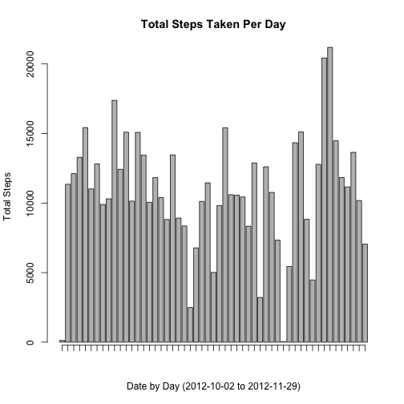

# Reproducible Research: Peer Assessment 1
### rcquan 06-07-2014
## Loading and preprocessing the data
After setting our working directory, we can begin to load our data into R. If
the file `activity.zip` is not in the current working directory, this function will
download and read in the required dataset. We also change the column classes to prepare
data for analysis in the following steps.

```r
read_data <- function() {
    fileName <- "activity.zip"
    url <- "https://d396qusza40orc.cloudfront.net/repdata%2Fdata%2Factivity.zip"
    if (!file.exists(fileName)) {
        download.file(url, fileName, method = "curl")
    }
    unzip(fileName, "activity.csv")
    data <- read.csv("activity.csv", colClasses = c("numeric", "character", 
        "numeric"))
    data$date <- as.Date(data$date)
    return(data)
}
data <- read_data()
```


## What is mean total number of steps taken per day?

### Histogram
By using the `aggregate` function, we can subset by date and apply the `sum` 
function to each day to obtain the number of steps taken per day. We first
visualize this using `barplot` to look at the total number of steps taken per day.

```r
barplot_StepsPerDay <- function(data) {
    df <- aggregate(steps ~ date, data = data, sum)
    df$date <- as.Date(df$date)
    bplot <- barplot(df$steps, xlab = "Date by Day (2012-10-02 to 2012-11-29)", 
        ylab = "Total Steps", main = "Total Steps Taken Per Day")
    bplot
    axis(1, at = bplot, labels = FALSE)
}
barplot_StepsPerDay(data)
```

 


### Mean
Let's calculate the mean by using the `aggregate` function once again. Since
`aggregate` returns a `data.frame` object, we can simply call `mean` on the
steps column.

```r
mean_StepsPerDay <- function(data) {
    df <- aggregate(steps ~ date, data = data, sum)
    mean(df$steps)
}
mean_StepsPerDay(data)
```

```
## [1] 10766
```


### Median
We do the same to calculate the median number of steps taken each day.

```r
median_StepsPerDay <- function(data) {
    df <- aggregate(steps ~ date, data = data, sum)
    median(df$steps)
}
median_StepsPerDay(data)
```

```
## [1] 10765
```


## What is the average daily activity pattern?

### Time-Series Plot
We can use the `aggregate` function once again to split the data into subsets,
this time into each 5-minute interval, and call the `mean` function on each to
get the average number of steps taken, averaged across all days.

```r
ts_plot <- function(data) {
    df <- aggregate(steps ~ interval, data = data, mean)
    plot(df$interval, df$steps, type = "l", xlab = "5-Minute Intervals", ylab = "Average Steps Taken Across All Days", 
        col = "blue")
}
ts_plot(data)
```

 


### 5-Minute Interval with Maximum Number of Steps on Average
Since the `aggregate` function returns a data.frame, we can return the row
with the maximum number of steps averaged across all days by subsetting.

```r
max_interval <- function() {
    df <- aggregate(steps ~ interval, data = data, mean)
    df[which.max(df$steps), ]
}
max_interval()
```

```
##     interval steps
## 104      835 206.2
```

## Imputing missing values

### Total number of missing values in the dataset
For the missing values, we will be imputing the mean number of steps taken for 
the 5-minute intervals on the assumption that the average daily activity pattern
is relatively consistent.

```r
impute_mean <- function() {
    # create data frame with column of indices for NA values
    na_indices <- which(is.na(data$steps))
    df_na <- cbind(data[na_indices, ], na_indices)
    
    # using indices of NA values, impute average steps per interval
    df_mean <- aggregate(steps ~ interval, data = data, mean)
    df_merged <- merge(df_na, df_mean, by.x = "interval", by.y = "interval")
    df_merged <- df_merged[order(df_merged$na_indices), ]
    
    imputed_data <- data
    imputed_data$steps[na_indices] <- df_merged$steps.y
    return(imputed_data)
}
imputed_data <- impute_mean()
```

### Histogram

```r
barplot_StepsPerDay(imputed_data)
```

 

### Mean

```r
mean_StepsPerDay(imputed_data)
```

```
## [1] 10766
```

### Median

```r
median_StepsPerDay(imputed_data)
```

```
## [1] 10766
```

Comparing the imputed dataset to the dataset with missing values, the mean total
number of steps taken per day stays the same while the median total number of steps
taken per day shifts up towards the mean.

## Are there differences in activity patterns between weekdays and weekends?

### Adding New Variable
To approach this problem, we first add a new variable to the imputed dataset
that indicates whether the given date is a weekend or a weekday.

```r
# categorizes days of week into weekdays or weekends
weekend_or_weekday <- function(var) {
    if (var %in% c("Sunday", "Saturday")) {
        var <- as.factor("Weekend")
    } else {
        var <- as.factor("Weekday")
    }
}
# adds factor variable WeekEndDay
add_WeekEndDay <- function(df) {
    list_DaysOfTheWeek <- weekdays(df$date)
    WeekEndDay <- sapply(list_DaysOfTheWeek, weekend_or_weekday)
    day_of_week_data <- cbind(df, WeekEndDay)
    return(day_of_week_data)
}
day_of_week_data <- add_WeekEndDay(imputed_data)
```

### Side-By-Side Time-Series Plots
With the `WeekEndDay` variable now indicating whether or not the given date is
a weekend or a weekday, we can subset the dataset and call our previously made 
`ts_plot` function to create time-series plots for each.

```r
library(lattice)
plot_WeekendVsWeekday <- function() {
    df <- aggregate(steps ~ interval + WeekEndDay, data = day_of_week_data, 
        mean)
    with(df, xyplot(steps ~ interval | WeekEndDay, type = "l", layout = c(1, 
        2)))
}
plot_WeekendVsWeekday()
```

 

Comparing the two time-series plots, we can see that the total steps taken during
weekends are, on average, greater than that taken during weekday, particularly around
midday. However, the weekday still has the highest peak around 800 minutes, perhaps
due to the subject's daily commute to work. 
